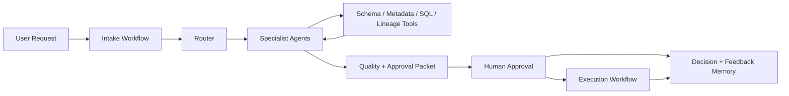

# Architecture

## Service overview

`dataops-agent-platform` operates as a control plane for AI-assisted data work. It does not replace warehouse modeling, orchestration, or operational ownership. Instead, it coordinates specialist agents, SQL-aware tools, review controls, and audit logging so that generated outputs remain traceable and governable.

## Architectural priorities

- keep transformation and KPI logic in Snowflake SQL
- keep orchestration, ingestion, and workflow control in Python
- preserve explicit human approval before execution or promotion
- attach evidence to every recommendation
- persist approvals, rejections, and reviewer rationale
- support environment separation across `dev`, `staging`, and `prod`

## Runtime services

### Intake service
Responsible for:
- normalizing freeform requests into `TaskRequest`
- assigning request IDs and environment context
- basic domain classification
- routing to the correct specialist agents

### Specialist agent layer
The agent layer is intentionally role-oriented:
- `DataEngineerAgent`: ingestion, ELT, Airflow, publication boundaries
- `DataArchitectAgent`: schema design, grain review, target-state modeling
- `DatabaseEngineerAgent`: SQL shape, runtime behavior, clustering and pruning
- `DbaAgent`: production safety, DDL review, maintenance window and rollback concerns
- `DataAnalystAgent`: KPI semantics and reporting logic
- `DataScientistAgent`: feature workflows and reproducibility
- `AiMlEngineerAgent`: training/scoring operational controls
- `CloudPlatformAgent`: CI/CD, environment promotion, platform release guidance
- `ObservabilityAgent`: quality rules, SLA coverage, alerting
- `DocumentationAgent`: runbooks, change summaries, operator-facing docs

### Tooling layer
Tools expose controlled read and generation capabilities:
- Snowflake SQL execution and explain-plan review
- schema metadata inspection
- ownership and lineage context
- Airflow DAG generation
- dbt-style SQL model generation
- quality and reconciliation checks
- runbook and technical document assembly

### Approval and execution layer
Approval is a first-class service boundary.

Before an artifact can move into execution:
- the artifact must be packaged with evidence
- quality checks must complete
- reviewer identity and rationale must be captured
- policy controls must allow the requested action

Execution is modeled separately from generation to prevent silent automation of production-affecting changes.

### Memory and audit layer
The memory layer stores:
- reviewer decisions
- structured feedback
- prompt versions
- execution outcomes

These records support operational review, trend analysis, and future retrieval of previously accepted patterns.

## Data flow

## Warehouse-first design

This repository prefers SQL for:
- staging and cleansing
- business rule expression
- KPI logic
- marts and semantic publication
- warehouse validation
- reconciliation queries

Python is intentionally limited to:
- request handling
- routing
- orchestration and control flow
- source/API ingestion
- utility wrappers around SQL artifacts
- ML helper logic where SQL is not the natural expression

## Operational boundaries

### Development environment
- allows broad generation and dry-run validation
- does not imply permission to publish or execute in production

### Staging environment
- used for integration checks, DAG validation, and warehouse acceptance queries
- requires reviewer sign-off for schema-affecting changes

### Production environment
- requires explicit approval
- requires policy-compliant execution
- requires immutable decision and execution logging

## Reliability notes

- workflow steps should be idempotent by request and artifact version
- retries should be reserved for transient transport or warehouse connectivity failures
- deterministic SQL models should be validated independently from orchestration code
- downstream publication should stop on failed tests or reconciliation mismatches
