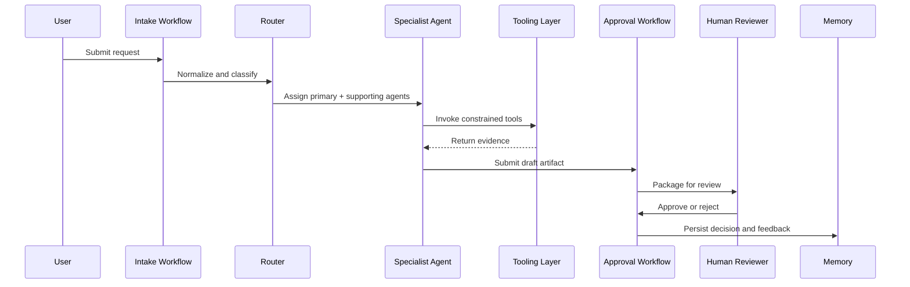

# Agent Interaction Diagram

```mermaid
sequenceDiagram
    participant U as User
    participant I as Intake Workflow
    participant R as Router
    participant S as Specialist Agent
    participant T as Tooling Layer
    participant A as Approval Workflow
    participant H as Human Reviewer
    participant M as Memory

    U->>I: Submit request
    I->>R: Normalize and classify
    R->>S: Assign primary + supporting agents
    S->>T: Invoke constrained tools
    T-->>S: Return evidence
    S->>A: Submit draft artifact
    A->>H: Package for review
    H->>A: Approve or reject
    A->>M: Persist decision and feedback
```

This markdown source is paired with `docs/agent-interaction.png`.
