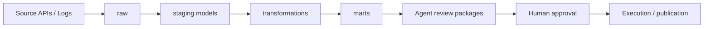

# Data Flow

```mermaid
flowchart LR
    A["Source APIs / Logs"] --> B["raw"]
    B --> C["staging models"]
    C --> D["transformations"]
    D --> E["marts"]
    E --> F["Agent review packages"]
    F --> G["Human approval"]
    G --> H["Execution / publication"]
```
