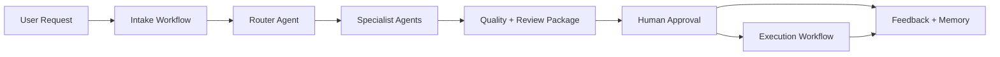

# Overview Diagram

```mermaid
flowchart LR
    A["User Request"] --> B["Intake Workflow"]
    B --> C["Router Agent"]
    C --> D["Specialist Agents"]
    D --> E["Quality + Review Package"]
    E --> F["Human Approval"]
    F --> G["Execution Workflow"]
    F --> H["Feedback + Memory"]
    G --> H
```

This markdown source is paired with `docs/overview.png`, which is kept as a static diagram asset for environments that expect image references.
