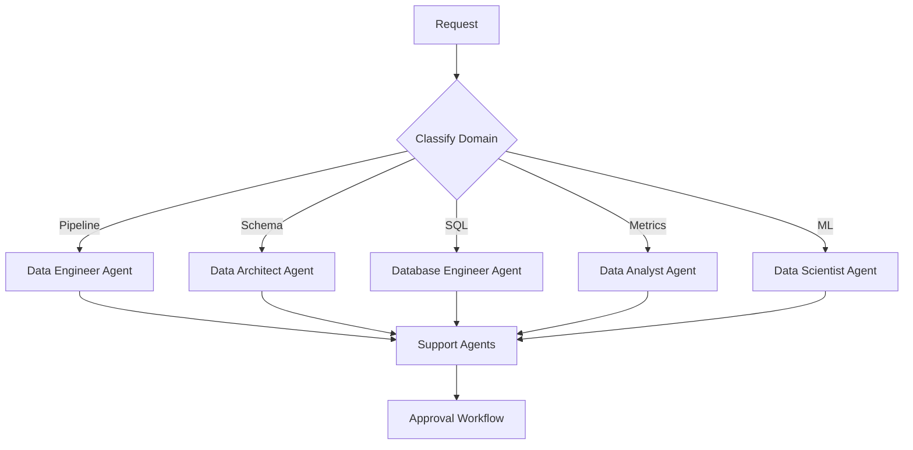

# Routing Flow Diagram

```mermaid
flowchart TD
    A["Request"] --> B{"Classify Domain"}
    B -->|Pipeline| C["Data Engineer Agent"]
    B -->|Schema| D["Data Architect Agent"]
    B -->|SQL| E["Database Engineer Agent"]
    B -->|Metrics| F["Data Analyst Agent"]
    B -->|ML| G["Data Scientist Agent"]
    C --> H["Support Agents"]
    D --> H
    E --> H
    F --> H
    G --> H
    H --> I["Approval Workflow"]
```

This markdown source is paired with `docs/routing-flow.png`.
