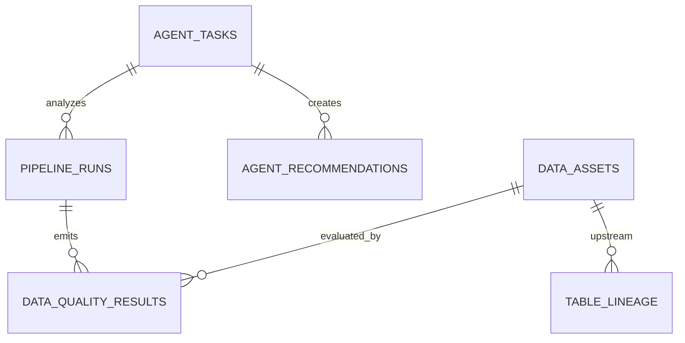

# Schema Overview

```mermaid
erDiagram
    AGENT_TASKS ||--o{ AGENT_RECOMMENDATIONS : creates
    AGENT_TASKS ||--o{ PIPELINE_RUNS : analyzes
    DATA_ASSETS ||--o{ TABLE_LINEAGE : upstream
    DATA_ASSETS ||--o{ DATA_QUALITY_RESULTS : evaluated_by
    PIPELINE_RUNS ||--o{ DATA_QUALITY_RESULTS : emits
```
